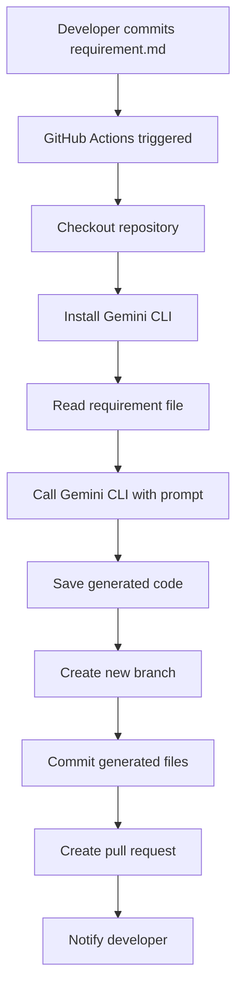

# Technical Flow - Core MVP

## 🔄 End-to-End Process Flow

### Step-by-Step Execution



## 🛠️ Technical Implementation

### 1. GitHub Actions Workflow

**File**: `.github/workflows/ai-code-gen.yml`

```yaml
name: AI Code Generation
on:
  push:
    paths: ['requirements/*.md']

jobs:
  generate-code:
    runs-on: ubuntu-latest
    permissions:
      contents: write
      pull-requests: write
    
    steps:
      - name: Checkout
        uses: actions/checkout@v4
        
      - name: Setup Node.js
        uses: actions/setup-node@v4
        with:
          node-version: '18'
          
      - name: Install Gemini CLI
        run: npm install -g @google/gemini-cli
        
      - name: Generate Code
        env:
          GEMINI_API_KEY: ${{ secrets.GEMINI_API_KEY }}
        run: |
          # Create output directory
          mkdir -p generated
          
          # Read requirement file
          REQUIREMENT_FILE=$(find requirements -name "*.md" -type f | head -1)
          REQUIREMENT_CONTENT=$(cat "$REQUIREMENT_FILE")
          
          # Generate unique branch name
          TIMESTAMP=$(date +%Y%m%d-%H%M%S)
          BRANCH_NAME="ai-generated/feature-$TIMESTAMP"
          
          # Create and switch to new branch
          git checkout -b "$BRANCH_NAME"
          
          # Generate code using Gemini CLI
          gemini -p "Generate code based on this requirement:
          
          $REQUIREMENT_CONTENT
          
          Rules:
          - Output only the code, no explanations
          - Use appropriate file extension
          - Include basic error handling
          - Add comments for clarity" > generated/generated-code.js
          
          # Commit generated code
          git config user.name "AI Code Generator"
          git config user.email "ai-bot@example.com"
          git add generated/
          git commit -m "AI Generated: Code from requirement"
          
          # Push branch
          git push origin "$BRANCH_NAME"
          
          # Create PR
          gh pr create \
            --title "🤖 AI Generated Code - $(basename "$REQUIREMENT_FILE" .md)" \
            --body "Auto-generated code from requirement: $REQUIREMENT_FILE" \
            --head "$BRANCH_NAME" \
            --base main
        env:
          GITHUB_TOKEN: ${{ secrets.GITHUB_TOKEN }}
```

### 2. Prompt Engineering Strategy

**Basic Prompt Template**:
```
Generate code based on this requirement:

{REQUIREMENT_CONTENT}

Rules:
- Output only the code, no explanations
- Use appropriate programming language
- Include basic error handling
- Add minimal comments
- Follow standard coding conventions
```

**Language-Specific Prompts**:
```bash
# For JavaScript
gemini -p "Generate JavaScript/Node.js code for: {requirement}"

# For Python
gemini -p "Generate Python code for: {requirement}"

# For general
gemini -p "Generate code in the most appropriate language for: {requirement}"
```

### 3. File Organization

```
project/
├── requirements/
│   ├── user-auth.md          # Input: requirement files
│   └── calculator.md
├── generated/                # Output: AI generated code
│   ├── user-auth.js
│   └── calculator.js
├── .github/workflows/
│   └── ai-code-gen.yml       # Automation workflow
└── docs/
    └── usage.md              # Documentation
```

### 4. Error Handling Strategy

**Workflow Level**:
```yaml
- name: Generate Code
  run: |
    # ... generation logic ...
  continue-on-error: true
  
- name: Handle Failure
  if: failure()
  run: |
    echo "Code generation failed"
    gh issue create --title "AI Code Generation Failed" --body "Check workflow logs"
```

**Gemini CLI Level**:
```bash
# Retry mechanism
for i in {1..3}; do
  if gemini -p "$PROMPT" > generated/code.js; then
    break
  else
    echo "Attempt $i failed, retrying..."
    sleep 5
  fi
done
```

## 🔧 Configuration Management

### Environment Variables
```bash
# Required
GEMINI_API_KEY=your_api_key_here

# Optional
GEMINI_MODEL=gemini-2.0-flash-exp
OUTPUT_DIR=generated
BRANCH_PREFIX=ai-generated
```

### GitHub Secrets Setup
1. Go to repository Settings → Secrets and variables → Actions
2. Add `GEMINI_API_KEY` with your API key from Google AI Studio
3. Ensure `GITHUB_TOKEN` has necessary permissions

## 🎯 Quality Gates

### Pre-Generation Validation
```bash
# Check if requirement file exists
if [ ! -f "$REQUIREMENT_FILE" ]; then
  echo "No requirement file found"
  exit 1
fi

# Check if requirement is not empty
if [ ! -s "$REQUIREMENT_FILE" ]; then
  echo "Requirement file is empty"
  exit 1
fi
```

### Post-Generation Validation
```bash
# Check if code was generated
if [ ! -f "generated/generated-code.js" ]; then
  echo "Code generation failed"
  exit 1
fi

# Basic syntax check (for JavaScript)
node -c generated/generated-code.js || echo "Syntax warning"
```

## 🚀 Deployment Strategy

### Setup Steps
1. **Repository Setup**
   ```bash
   git clone <repo>
   mkdir requirements generated
   ```

2. **Secrets Configuration**
   - Add `GEMINI_API_KEY` to GitHub Secrets
   - Verify repository permissions

3. **Workflow Activation**
   - Commit workflow file
   - Test with sample requirement

4. **First Test**
   ```bash
   echo "# Test Feature\nCreate a hello world function" > requirements/test.md
   git add requirements/test.md
   git commit -m "Add test requirement"
   git push
   ```

### Monitoring
- Check GitHub Actions tab for workflow status
- Monitor PR creation
- Review generated code quality

## 🔍 Debugging Guide

### Common Issues
1. **Workflow not triggering**
   - Check file path: `requirements/*.md`
   - Verify push to correct branch

2. **Gemini CLI errors**
   - Verify API key in secrets
   - Check API quota limits
   - Review prompt format

3. **PR creation fails**
   - Check GitHub token permissions
   - Verify branch creation
   - Review repository settings

### Debug Commands
```bash
# Test Gemini CLI locally
export GEMINI_API_KEY="your_key"
echo "Create a hello function" | gemini -p "Generate JavaScript code for: $(cat)"

# Test GitHub CLI
gh auth status
gh pr list
```

## 📊 Success Metrics

### Technical Metrics
- Workflow success rate: >90%
- Code generation time: <2 minutes
- PR creation success: 100%

### Quality Metrics
- Generated code compiles: >80%
- Code addresses requirement: >70%
- PR review time: <1 day

This technical flow provides a complete, implementable solution for the core MVP functionality.
